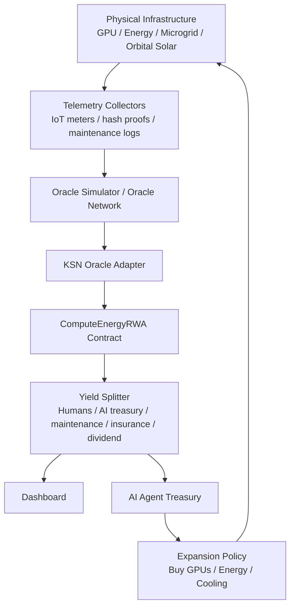

# Architecture

## System overview



---

## Components

### Web dashboard

Located in `apps/web`.

Responsible for:

- Visualizing Kardashev stage.
- Comparing KSN score across asset types.
- Showing ownership transition from human to AI.
- Showing yield allocation.

### Core simulation engine

Located in `packages/core`.

Responsible for deterministic calculations:

- `computeKsnScore`.
- `estimateKardashevType`.
- `classifyAssetStage`.
- `simulateYieldDistribution`.
- `advanceAgencyScene`.

### Oracle simulator

Located in `packages/oracle-sim`.

Provides mock telemetry over HTTP.

The current repo ships `packages/oracle-sim` as the executable oracle path; planned docs may mention a future `packages/oracle` package for multi-source verification and aggregation.

Endpoints:

```txt
GET /health
GET /telemetry/:assetId
POST /simulate
```

### Contracts

Located in `packages/contracts`.

Contract set:

| Contract | Responsibility |
|---|---|
| `ComputeEnergyRWA.sol` | RWA share accounting and distribution events |
| `KSNOracleAdapter.sol` | Ingests energy/compute telemetry |
| `AIAgentTreasury.sol` | Autonomous treasury policy boundary |

---

## Data flow

```txt
Physical asset
  -> telemetry collection
  -> oracle aggregation
  -> KSN score update
  -> smart contract settlement
  -> yield split
  -> dashboard / AI treasury policy
```

---

## Security boundaries

| Boundary | Main risk | Control |
|---|---|---|
| Sensor to oracle | spoofed telemetry | signed measurements, redundancy |
| Oracle to chain | corrupted feed | medianization, delay, dispute window |
| Contract accounting | accounting bug | audits, invariants, tests |
| AI treasury | runaway purchases | caps, timelocks, human veto |
| Physical asset | sabotage/theft | custody, insurance, operational monitoring |
| Legal wrapper | unenforceable token claim | jurisdiction-specific legal design |

---

## Suggested production migration path

1. Replace `oracle-sim` with a real telemetry ingestion service.
2. Use signed hardware measurements or attestation.
3. Add compliance-aware transfer restrictions.
4. Add formal legal wrapper documents.
5. Add risk module for grid safety and securities-law gating.
6. Add simulation backtesting before any autonomous treasury action.
