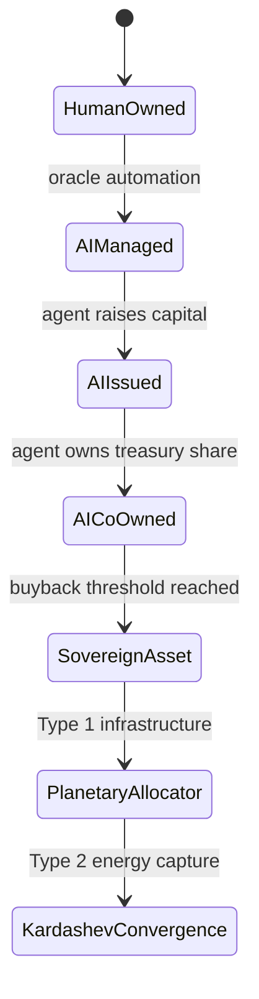

# 12 Scenes of AI × KSN-RWA

This file maps AI agency stages into Kardashev-scale RWA infrastructure.

## Scene 1 — Passive Analytics

AI predicts utilization and energy yield. Humans still own and operate the assets.

## Scene 2 — Optimization Copilot

AI recommends pricing, maintenance windows, and energy routing.

## Scene 3 — Oracle-Driven Agent

AI has a wallet-like operational account. It reacts to oracle data and dynamically rents assets.

Example:

- Move compute workload to low-cost energy region.
- Increase inference price during demand spikes.
- Reserve maintenance budget after abnormal telemetry.

## Scene 4 — Autonomous Portfolio Manager

AI rebalances between energy credits, compute credits, insurance reserves, and stable liquidity.

## Scene 5 — Machine Lease Coordinator

AI coordinates fleets of machines: GPUs, robots, drones, and grid devices.

## Scene 6 — Self-Financing Agent

AI uses operating surplus to buy additional compute or energy access.

## Scene 7 — Algorithmic Legal Entity

AI uses a legal wrapper, DAO, or human-controlled entity to issue RWA shares and expand its infrastructure base.

## Scene 8 — Recursive DePIN Operator

AI operates multiple DePIN networks and routes demand between them.

## Scene 9 — Strategic Infrastructure Buyer

AI chooses asset acquisitions based on bottlenecks: energy, cooling, network latency, regulatory risk, or hardware scarcity.

## Scene 10 — Sovereign Asset

AI buys out human RWA holders. The physical infrastructure becomes economically controlled by the AI entity.

## Scene 11 — Planetary Infrastructure Allocator

AI coordinates planetary-scale energy and compute routing.

## Scene 12 — Kardashev Convergence

Autonomous AI infrastructure abstracts Type 1 or Type 2 energy into liquid compute-energy contracts and distributes surplus through planetary dividend mechanisms.

---

## Scene-state machine

