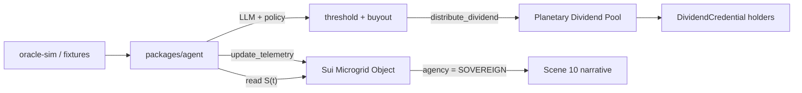

# Sui Overflow 2026 — Agentic Microgrid MVP

**Track:** Core Track — Agentic Web  
**Repository:** KSN-AI-RWA-Civilization-Stack  
**Registration:** https://overflow.sui.io/

## One-line pitch

We turn KSN **Scene 10 (Sovereign Asset)** into a Sui shared object: an AI agent holds an `AgentCap`, watches microgrid `S(t)=P(t)/H(t)`, autonomously funds its treasury, buys out human ownership, and distributes **Planetary Dividends** to credential holders.

## Demo timeline (Scenes 3 → 6 → 10 → 12)

| Step | Scene | On-chain action | Agent decision |
|------|-------|-----------------|----------------|
| 1 | Oracle-driven Agent | `update_telemetry` | Read oracle / fixture → push `P,H` on-chain |
| 2 | Self-Financing Agent | `deposit_yield` | Seed AI treasury from operating surplus |
| 3 | Sovereign Asset | `execute_buyout` | Transfer control when treasury ≥ buyout threshold |
| 4 | Kardashev Convergence | `distribute_planetary_dividend` + `claim_dividend` | Release civilization dividend when KSN score ≤ threshold |

## Architecture



## Packages

| Path | Role |
|------|------|
| [`packages/sui-contracts/`](../packages/sui-contracts/) | Move modules: `microgrid`, `agent_cap`, `credential` |
| [`packages/agent/`](../packages/agent/) | TypeScript agent: Sui SDK + OpenAI/Ollama + deterministic policy guardrails |
| [`scripts/sui-overflow-demo.sh`](../scripts/sui-overflow-demo.sh) | One-command local demo |

## Prerequisites

- Node.js 20+
- pnpm 9+
- [Sui CLI](https://docs.sui.io/guides/developer/getting-started/sui-install) (`brew install sui`)

## Quick start (local)

```bash
pnpm install

# Terminal A — optional oracle feed
pnpm --filter @aks/oracle-sim dev

# Terminal B — full demo (starts local validator if needed)
pnpm sui:demo
```

Manual steps:

```bash
# 1. Start local validator (once)
sui start --with-faucet --force-regenesis

# 2. Switch + faucet
sui client switch --env local
curl -X POST http://127.0.0.1:9123/gas \
  -H 'Content-Type: application/json' \
  -d '{"FixedAmountRequest":{"recipient":"<YOUR_ADDRESS>"}}'

# 3. Publish + seed demo objects
pnpm --filter @aks/sui-contracts build
pnpm --filter @aks/sui-contracts exec tsx scripts/publish.ts
pnpm --filter @aks/sui-contracts exec tsx scripts/setup-demo.ts

# 4. Run agent loop
pnpm --filter @aks/agent start:once   # single cycle
pnpm --filter @aks/agent start        # continuous polling
```

## Environment variables

| Variable | Default | Description |
|----------|---------|-------------|
| `SUI_RPC_URL` | `http://127.0.0.1:9000` | Sui JSON-RPC endpoint |
| `SUI_PACKAGE_ID` | from `demo-state.json` | Published package ID |
| `SUI_MICROGRID_ID` | from `demo-state.json` | Shared microgrid object |
| `SUI_AGENT_CAP_ID` | from `demo-state.json` | Agent capability object |
| `OPENAI_API_KEY` | — | Optional LLM provider |
| `OLLAMA_BASE_URL` | — | Optional local LLM (OpenAI-compatible) |
| `ORACLE_URL` | `http://127.0.0.1:8787` | Mock telemetry source |
| `AGENT_ALLOW_BUYOUT` | `true` | Hard guardrail for Scene 10 |

Without `OPENAI_API_KEY` / `OLLAMA_BASE_URL`, the agent uses **deterministic policy** in [`packages/agent/src/policy.ts`](../packages/agent/src/policy.ts).

## Agentic Web alignment

- **Autonomous actor:** Agent holds `AgentCap` and signs transactions without human confirmation each cycle.
- **Object-centric Sui model:** Microgrid is a shared object; credentials and capabilities are first-class objects.
- **Safety boundary:** LLM proposes actions; on-chain thresholds + `filterAllowedAction()` enforce whitelist (aligned with `AIAgentTreasury` timelock spirit in Solidity skeleton).

## Testnet submission notes

1. `sui client switch --env testnet && sui client faucet`
2. Replace `test-publish` with `sui client publish` in [`publish.ts`](../packages/sui-contracts/scripts/publish.ts) (automatic when active env ≠ `local`)
3. Record package / object IDs in `deployments/demo-state.json`
4. Record a screen capture of `pnpm sui:demo` showing **deposit → buyout → dividend** events

## Related docs

- [`docs/SCENES.md`](SCENES.md) — 12 Scenes narrative
- [`docs/WHITEPAPER.md`](WHITEPAPER.md) — `S(t)=P(t)/H(t)` metric
- [`docs/diagrams/dual-axis.mmd`](diagrams/dual-axis.mmd) — Kardashev × Agency dual-axis
